LB-AfanasievMykhailo
Афанасьєв Михайло IПЗ 3.02
Лабораторна робота № 1
Тема: Ознайомлення з TypeScript
Мета роботи: Ознайомитися з основами мови TypeScript шляхом виконання практичних завдань, що демонструють базові можливості мови: типізацію, інтерфейси, класи, композитні типи та дженерики.
Завдання:
1.	Типізація змінних

Використовуючи оператор let, я оголосив змінні типів: string, number, boolean, array, object. Потім я створив функцію, яка приймає як аргумент об'єкт із полями name (тип string) та age (тип number) і повертає рядок виду: "Name: John, Age: 30".

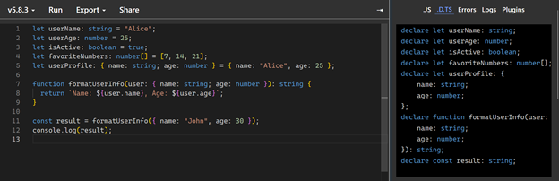

Рис.1 - Перегляд созданих типiв  

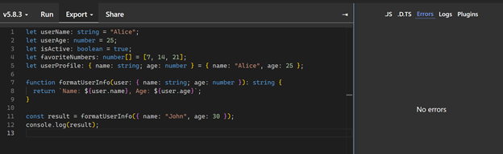

Рис.2 - Вкладка помилок  

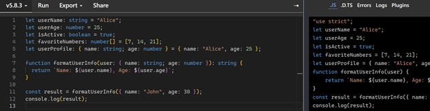

Рис.3 - Скомпiльований JavaScript-код  

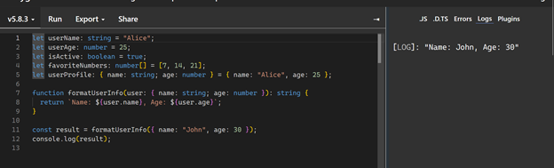

Рис.4 - Перевiрки правильностi роботи коду

2.	Інтерфейси

Створивши iнтерфейс Person зi змiнними name, age та не обов'язковим address, я зробив функцiю, яка приймає об'єкт типу Person та виводить його дані у консоль. 

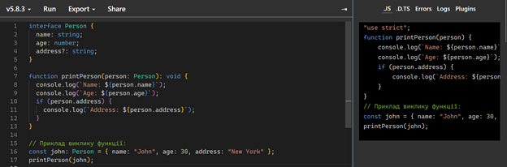

Рис.5 - Скомпiльований JavaScript-код 

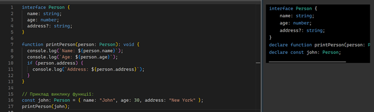

Рис.6 - Перегляд созданих типiв  

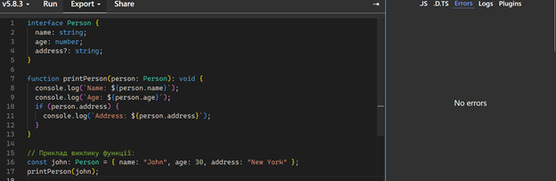

Рис.7 - Вкладка помилок 

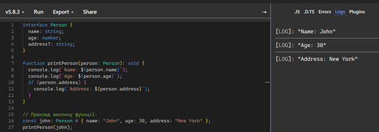

Рис.8 - Перевiрки правильностi роботи коду

3.	Композитні типи
Оголосивши об'єднаний тип Status з трьома можливими значеннями 'success', 'error' та 'loading', я створив функцію, яка виводить повідомлення відповідно до значення Status.

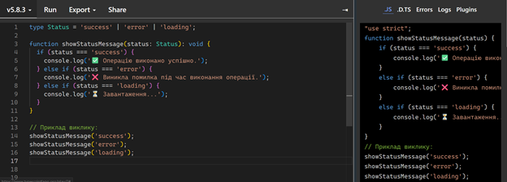

Рис.9 - Скомпiльований JavaScript-код

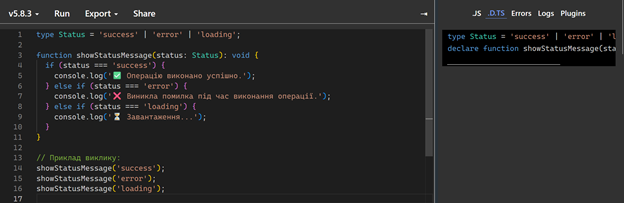

Рис.10 - Перегляд созданих типiв  

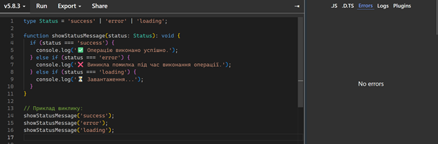

Рис.11 - Вкладка помилок

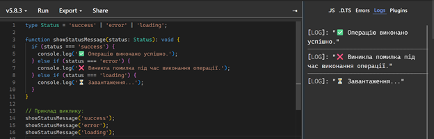

Рис.12 - Перевiрки правильностi роботи коду
5.	Дженерики
Розробивши функцію identity(value: T): T, яка повертає передане їй значення, я використав її для типів number, string та boolean.  

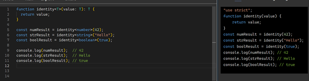

Рис.13 - Скомпiльований JavaScript-код

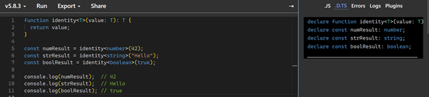

Рис.14 - Перегляд созданих типiв  

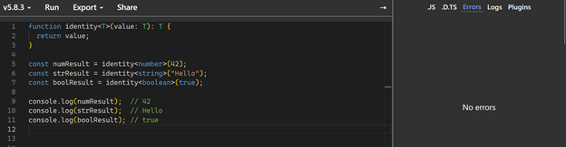

Рис.15 - Вкладка помилок 

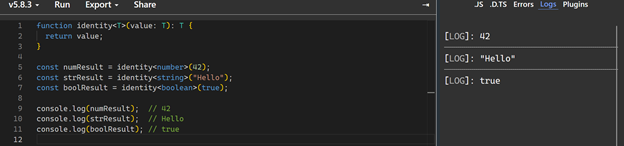

Рис.16 - Перевiрки правильностi роботи коду
6.	Класи
Реалiзувавши клас Car, який мiстить поля model та year, я додав метод getCarInfo(), який повертає рядок виду: "Model: Toyota, Year: 2020".  

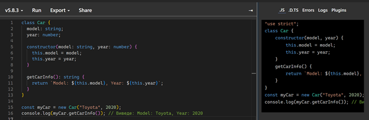

Рис.17 - Скомпiльований JavaScript-код  

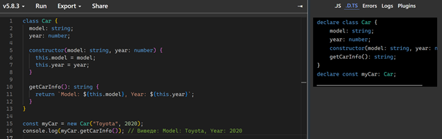

Рис.18 - Перегляд созданих типiв 

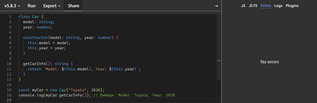

Рис.19 - Вкладка помилок  

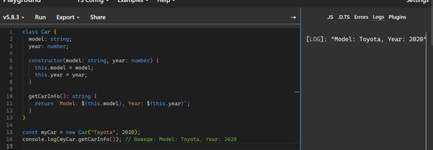

Рис.20 - Перевiрки правильностi роботи коду
Висновок: У процесі виконання цієї лабораторної роботи я ознайомився з базовими можливостями мови TypeScript.
На практиці закріпив розуміння типізації, роботи з об’єктами, функціями, інтерфейсами, об’єднаними типами, дженериками та класами.
Це дало змогу краще зрозуміти принципи статичної типізації та структурування коду в TypeScript.
